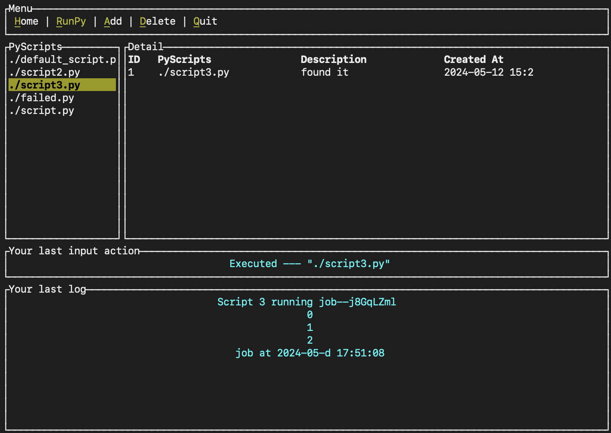
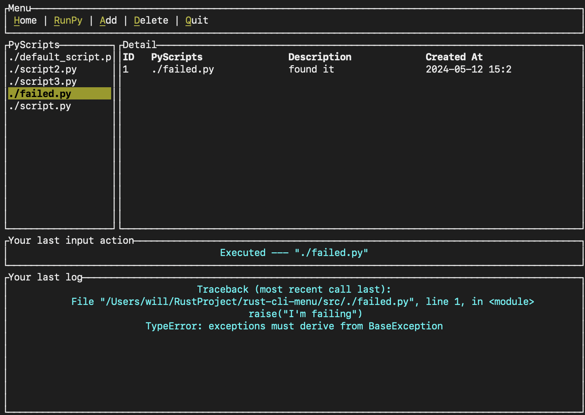

# Rust CLI Project
by meswsoul, 2024

## Overview
This project is an enhanced version of [Pet CLI](`https://github.com/zupzup/rust-commandline-example`) by [Zupan].

Building on the Rust TUI example, I developed a CLI tool designed for managing Python scripts, adding several features to improve functionality.

## Key Features
- **.env Support**: Easily manage environment variables.
- **Json Initialization & Error Handling**: Set up Json and handle errors in your workflows.
- **Script Execution**: Run Python scripts directly from the CLI.
- **Logs**: View logs for `stdout`, `stderr`, and execution results.

---
## Examples:

### 1. Run Script & Return Results

---
### 2. Error Handling: Return `Stderr`

---

## How to Use

- **Option 1 - Run with Cargo**: `$ cargo run`
- **Option 2 - Build an Executable**: Compile the project into an executable for cross-platform usage.

